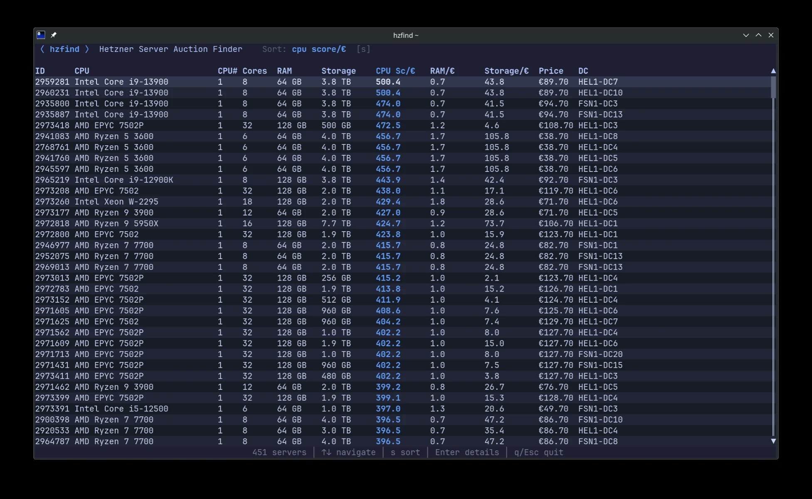
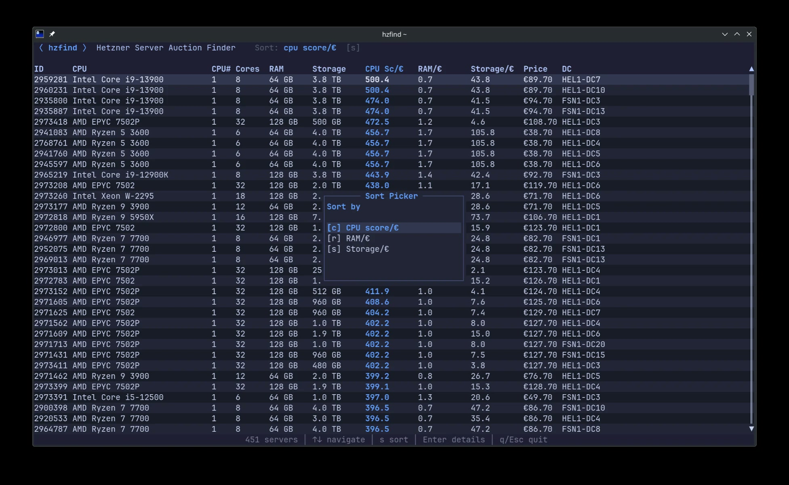
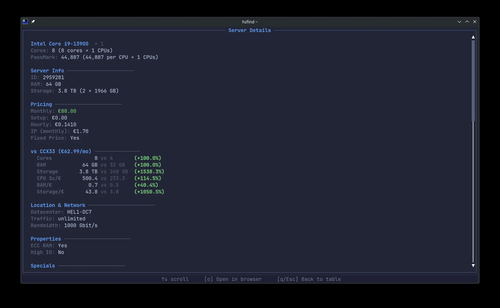

# hzfind

A CLI/TUI to find the best [Hetzner Server Auction](https://www.hetzner.com/sb/) deals.

Ships with the [PassMark](https://www.cpubenchmark.net/) CPU benchmark database built-in so you can instantly comapre servers by **value per euro** - CPU score/€, RAM/€, and storage/€.

Hetzner auction data is fetched live. Prices are **exclusive of VAT**.

## Screenshots





## Installation

```bash
# From source
cargo install --git https://github.com/clouedoc/hzfind
```

Requires Rust 2024 edition (1.85+).

## Usage

```bash
hzfind            # launches the interactive TUI (default)
hzfind explore    # same thing

hzfind list                      # list all servers as JSON
hzfind list --sort cpu --top 10  # sort by best CPU value, show top 10
hzfind list --sort storage       # sort by storage value
hzfind list --sort ram           # sort by RAM value

hzfind list-stats                # aggregated stats about current auction data
```

## How it works

1. Fetches the live Hetzner Server Auction feed (`live_data_sb_EUR.json`)
2. Matches each server's CPU against the bundled PassMark database
3. Computes per-euro metrics: **CPU score/€**, **RAM GB/€**, **Storage GB/€**
4. In the TUI, optionally compares each server against a **CCX33** cloud baseline (€62.99/mo) to show relative value

## License

MIT
